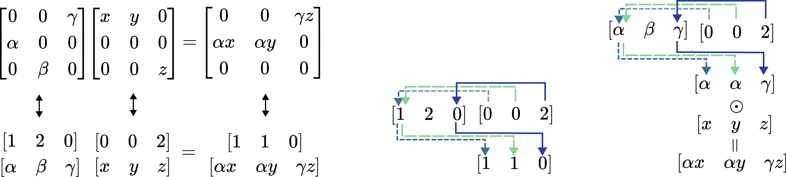

# Structured Sparse Transition Matrices to Enable State Tracking in State-Space Models

Paper: [https://arxiv.org/abs/2509.22284](https://openreview.net/pdf?id=RDbuSCWhad)


This repository contains the core implementation and experiments for our NeurIPS 2025 spotlight paper, *Structured Sparse Transition Matrices to Enable State Tracking in State-Space Models*.
The implementation is split into two submodules for reproducing our main experimental results:

- **State-tracking tasks**  implemented in **PyTorch**
- **Time-series classification tasks** implemented in **JAX**

Each submodule has its own set of dependencies. The instructions on setting up the environment and reproducing our results are provided in each submodule separately.

The rest of this text contains a short summary of our paper.


## 🧠 Core Idea 

### Background

Neural Networks which utilize linear recurrences are often called **State-Space Models**.
With input at time $t$ being $u_t$, the state $x_t$ is recurrently evaluated as:

$$
x_{t+1} = A(u_t)x_t + Bu_t
$$

Such linear recurrences can be evaluated using a parallel algorithm, which enables large-scale training.
SSMs have found application in a range of large-scale LLMs, including commerical industrial ones.

A well-documented challenge in modern SSMs is that of ***balancing expressivity and efficiency***.
Modern SSMs often utilize transition matrices $A(u_t)$ which enable **efficient computation, but exhibit restricted expressivity**. 
*(These models must be very wide and deep in order to track the states of certain finite-state automata)*.

### Our Contribution 


We propose a novel structure of the transition matrix $A(u_t)$ based on the idea of structured sparsity.
Concretely, $A(u_t)$ is generated such that each column has a single non-zero complex-valued element. 

Such matrices require $O(N)$ instead of the general $O(N^2)$ memory to store, and matrix-matrix multiplication costs $O(N)$ as opposed $O(N^3)$ time.
Additionally, they are closed under matrix multiplication, implying that long chains of matrix products can be efficiently evaluated.

We provide a parametrization of such matrices that ensures BIBO stability, implying that the states will never numerically explode to unbounded values under bounded input.
The matrices are factorized as $A(u_t)=P(u_t)D(u_t)$, resulting in the $PD-SSM$ model.

<p align="center">
<br>
<em>We propose a structured sparse parametrization of SSM transition matrices.</em>
</p>

In terms of experimental results:

- The model exhibits state-of-the-art ability to track the states of finite-state automata of various complexities. 
- It achieves the best accuracy on the *Long-Range Arena* dataset among the considered time-variant SSM models
- It achieves the second-best score on *UEA Time-Series Classification* among a range of methods based on SSMs as well as neural-controlled differential equations.


## 🔍 Overview of PD-SSM Design

### Computational Efficiency through Structured Sparsity

PD-SSM utilizes structured sparse transition matrices $A(u_t)$ in the SSM recurrence $x_t = A(u_t)x_{t-1}+Bu_t$.
Concretely, the matrix structure is *complex-valued column-sparse*, meaning that each column contains a single complex number. 
This enables for memory- and compute-efficient matrix-matrix multiplication as per the below figure:

<p align="center">
  <br>
  <em>PD-SSM is based on column-sparse matrices which allow for linear memory and time matrix-matrix multiplication.</em>
</p>

### Differentiable Sparse Matrix Generator


<p align="center">
<br>
</p>

The transition matrices are parametrized as $A(u_t)=P(u_t)D(u_t)$. The first factor $P(u_t)$ is a column one-hot matrix, parametrized as shown above and in equations (1), (2) and (3) below. 
The second factor $D(u_t)$, equations (4) and (5), is a complex-valued diagonal matrix with entries inside the unit circle. This ensures BIBO stability and is designed to generalize the commonly-used diagonal transition matrices.

<p align="center">

</p>

The gradients are propagated through the column sparsifier according to the straight-through estimator $\partial P / \partial M \approx \partial softmax(M) / \partial M$. While this is not known to be an unbiased estimator of any quantity relevant for training, it is widely used in practice as it preserves the sparsity necessary for efficient computation.


One layer of the models we use in the LRA and time-series experiments follows the standard Transformer post-norm architecture, as shown below. $H^{N \times N}$ denotes the monoid of column sparse matrices.

<p align="center">
<br>
  <em>The full model follows the Transformer post-norm design.</em>
</p>


## 📊 Experimental Results


### Length Generalization on FSA State Tracking

We compare our model to a range of recurrent methods. The baseline results are provided by (Walker et al. 2025). We fully conform to their experimental procedure, using two layers, state dimension 128, and a fixed learning rate schedule. 

Our method significantly outperforms the second-best alternative, achieving almost full average length generalization accuracy (train $\leq 40$, test $40 - 256$).

<p align="center">
<br>
  <em>FSA Emulation Results</em>
</p>


### Long Sequence Time-Series Classification

On a collection of multiclass long-sequence time-series classification datasets from the *UEA Time-Series 2018* collection, we compare our model with a range of baselines provided by (Rusch and Rus, 2025). 
On a matched hyperparameter grid, our method exhibits the second highest accuracy among all of the investigated models, demonstrating that it can have utility in more demanding realistic applications.

<p align="center">
<br>
  <em>Time-Series Results.</em>
</p>

## 📝 Insights on Expressivity and Results

### Mapping an FSA to an SSM

Any finite-state automaton can be emulated using the linear system $x_{t+1} = A(u_t)x_{t}$ with one-hot state vectors $x_t$ and column one-hot $A(u_t)$. 
In general, this requires one layer, a state size of $N$, and a linear readout layer of size $N \times N$.
An important class of automata, that of modular counters, admits a more compact representation with unit magnitude complex numbers.
Two example FSAs and their mappings to $A(u_t)$ are shown below.

<p align="center">
<br>
  <em>Two mappings of FSA dynamics to SSM transition matrices.</em>
</p>

#### Construction of Almost-Worst-Case Automata

In Appendix C we provide a construction of a finite-state automaton with N states that cannot be emulated by the SSM equations $x_t = A_t x_{t-1} + b_t$ when the dimension of $x_t$ is less than $N-1$. 
The exact statement reads as follows:

For any $N$ there exists a finite-state automaton with $N$ states that cannot be emulated by any single-layer SSM with state size less than $N-1$ if each automaton state is represented by a unique vector.

With this in mind, we can see that the mapping provided by PD-SSM is optimal in the worst case, as universal FSA emulation cannot be guaranteed by an SSM layer with state size less than $N-1$.

### Automata Based on Algebraic Groups

A Cayley diagram of an algebraic group immediately suggests an interpretation of it as a finite-state automaton. 
Shown below are Cayley diagrams of two different grups, $Z_2 \times Z_4$ and $D_4$.

<p align="center">
<br>
  <em>Cayley diagrams immediately imply a finite-state automaton. A single group might have many Cayley diagrams.</em>
</p>

### Theoretical and Experimental Expressivity Limits of Structured SSMs

A central property of finite-state automata which upper bounds diagonal SSMs expressivity is solvability. 
Under certain (practically relevant) conditions, diagonal SSMs cannot emulate automata corresponding to non-solvable groups. This is indicated by ✖️.

Methods based on products of Householder matrices can in theory emulate such automata, but might require significant depth and exponentially large linear layers. This is indicated by ✔️ $^{*}$.

<p align="center">
<br>
  <em>An overview of the results on SSM expressivity.  </em>
</p>

Empirically, on two non-solvable automata $A_5$ and $S_5$, we experiment with two layers of a complex-valued diagonal model, one and two layers of a method based on products of Householders, and one layer of our method.
In each of the two groups, we add random transitions such that they do not repeat and that they preserve the group structure. This increases the connectivity of the resulting automaton, which is expected to make the task more complex. Length generalization results (train $\leq 40$, validate $40-256$) are shown below.

<p align="center">
<br>
  <em>PD-SSM learns to track the states of increasingly interconnected non-solvable group automata.  </em>
</p>

## 📚 Citation
If you use PD-SSM or build upon state-space modeling techniques in your research, please consider citing our work as:

```bibtex
@inproceedings{terzic_2025_pdssm,
 	author = {Terzić, Aleksandar and Menet, Nicolas and Hersche, Michael and Hofmann, Thomas and Rahimi, Abbas},
    note = {Aleksandar Terzić and Nicolas Menet contributed equally to this work.},
 	booktitle = {Advances in Neural Information Processing Systems (NeurIPS)},
 	month = {December},
 	pdf = {https://arxiv.org/abs/2509.22284},
 	title = {Structured Sparse Transition Matrices to Enable State Tracking in State-Space Models},
 	year = {2025}}
```
